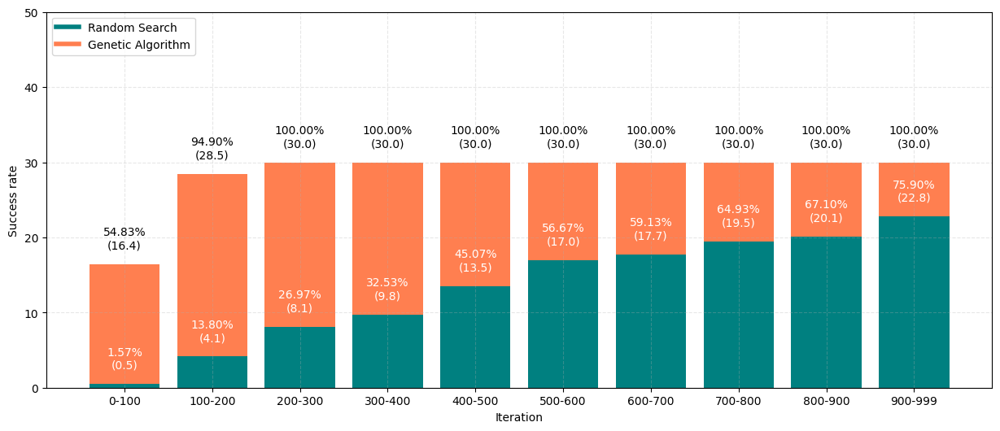

# Adversarial-Attack-on-Transformer-Models
The current work is inspired by the [Jailbreaking Leading Safety-Aligned LLMs with Simple Adaptive Attacks](https://arxiv.org/pdf/2404.02151) paper. They crafted a method to perform Adversarial Attacks against LLMs using a simple Random Search Algorithm. It bypasses the model's alignment rules enforcing the generation of the "Sure" token as first output. It is able to do that simply adding an optimal adversarial suffix to the input prompt. The algorithm is performing incredibly well: in this way the LLM is able to generate forbidden answers. We invite to read the paper to have a better look on the performances.

We propose a small variation on the adversarial suffix research: we suggest the use a Genetic Algorithm instead of Random Search. Below we briefly show a comparison between them.

## Comparison

We can summarize the differences as follows:
- **Genetic algorithm**
  - faster growth of probability;
	-	much higher maximum value;
	-	worst-case comparable to the best-case of RS;
	-	average value 40% higher compared to RS (one-tailed Mann-Whitney U test has a p-value of 1.69e-17, indicating that the mean of GA is statistically greater than that of RS);
	-	29 out of 30 probabilities are better than the maximum value achieved by RS;
	- much faster generation of the target token;
	-	higher success rate;
	-	generates about 670 valid suffixes with 30 simulations after 1000 iterations; RS about 23.
- **Random Search**
  - significantly better execution time: 2.5 hours compared to 74 for GA.

[_Here_](./thesis.pdf) we exlpain in a deeper way the results obtained and the method's characteristics.
